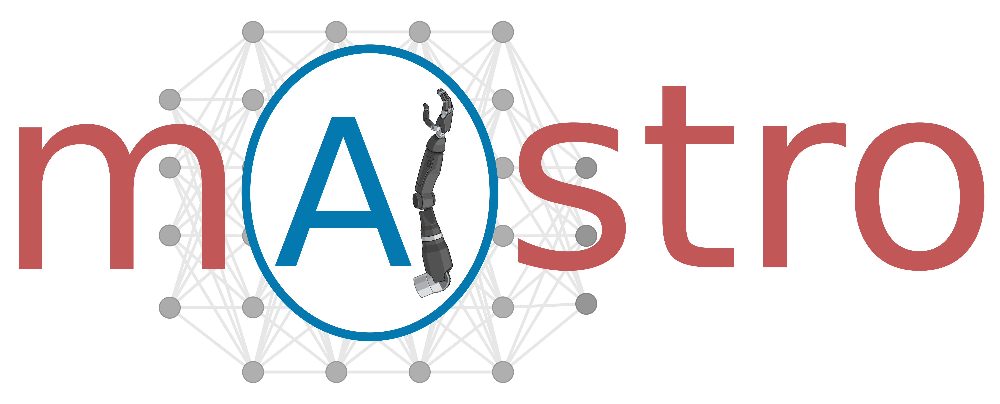
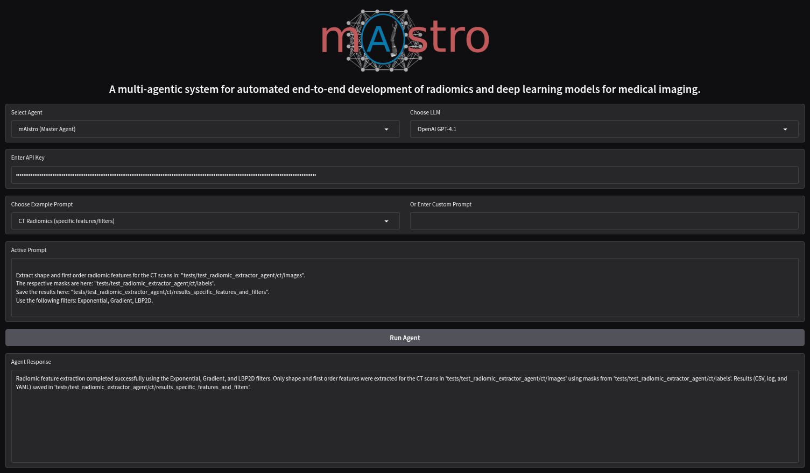

  

> An open-source multi-agentic system for automated end-to-end development of radiomics and deep learning models for medical imaging

---

## 🚀 About mAIstro
**mAIstro** is an autonomous, open-source multi-agent system designed to orchestrate the full pipeline of medical imaging AI development - from **exploratory data analysis (EDA)** and **radiomics feature extraction** to **training and deploying deep learning models**.  
Built around a team of specialized agents, mAIstro enables researchers and clinicians to interact with complex AI workflows **using natural language prompts** - no coding required.

🌐 **LLM-Agnostic Design**: mAIstro can operate with both open-source and commercial LLMs (e.g., GPT-4, Claude, DeepSeek, LLaMA, Qwen), providing flexibility across environments.

⭐ If you find mAIstro useful, please consider starring the repository to support the project and help others discover it!

---

## ✨  Key Features
- 🔎 Autonomous **Exploratory Data Analysis (EDA)**
- 🧬 **Radiomics feature extraction** (for CT, MRI, and multi-parametric imaging)
- ⚙️ **nnU-Net Agent** for segmentation model development and implementation
- ⚙️ **TotalSegmentator Agent** for full-body and organ-specific automatic segmentation
- 🩻 **Image Classification Agent** (ResNet, VGG16, InceptionV3 architectures)
- 📊 **Feature Importance and Feature Selection**
- 📈 **Tabular data Classification and Regression Agents**
- 🛠️ Modular tool-based architecture for extensibility
- 🧾 Integrated in a single user-friendly Jupyter Notebook

---

## ⚙️ Instructions to Set Up Docker and Run the mAIstro Environment

👉 [Instructions to set up Docker and run mAIstro](./install_mAIstro_env.md)

---
## 🔗 Run mAIstro instantly on Google Colab

Want to try mAIstro without setting up anything locally?

You can now run the full framework interactively on Google Colab

👉 [**Launch mAIstro on Colab**](https://colab.research.google.com/drive/1aXNwh9hT9txLIiPetAtIed0_lYiCE3Wv?usp=sharing)

  

What’s included:

All necessary requirements are automatically installed

The full mAIstro_workspace folder is downloaded, including:

  ✅Experiment data

  ✅Predefined folders and structure

  ✅Ready-to-run example prompts pointing to the correct locations

🔐 What you need to do:
The only manual step is to provide your API key for the LLM of your choice (e.g., OpenAI, Claude, DeepSeek, etc.).

A pre-configured cell is provided with options for multiple LLM providers – just paste your key and you're ready to go!

This makes it easy to explore and test the full functionality of mAIstro on any device, using just your browser.

### 📹 Tutorial Video - mAIstro on Colab

[Watch the tutorial on Google Drive](https://drive.google.com/file/d/1EE4cgs0QOk4S_yT6aKBtHO8Bn8lvhn6A/view?usp=drive_link)

---

## 📚 Tools Documentation

The following tools are part of the mAIstro multi-agentic system. Each tool is described in detail in its own documentation file:

1. [Radiomics Tool](docs/pyradiomics_tool_doc.md)
2. [Exploratory Data Analysis Tool](docs/eda_tool_doc.md)
3. [Feature Selection Tool](docs/feature_selection_tool_doc.md)
4. [nnUNet Training Tool](docs/nnUNet_training_tool_doc.md)
5. [nnUNet Inference Tool](docs/nnUNet_inference_tool_doc.md)
6. [TotalSegmentator Tool](docs/TotalSegmentator_tool.doc.md)
7. [PyCaret Classification Training Tool](docs/pycaret_classification_training_tool_doc.md)
8. [PyCaret Classification Inference Tool](docs/pycaret_classification_inference_tool_doc.md)
9. [PyCaret Regression Training Tool](docs/pycaret_regression_training_tool_doc.md)
10. [PyCaret Regression Inference Tool](docs/pycaret_regression_inference_tool_doc.md)
11. [Medical Image Classification Tools](docs/medical_image_classification_tools_doc.md)

---

## 📄 License

This project is licensed under the **Apache License 2.0**.  
You are free to use, modify, and distribute this software under the terms of the license.

---

### 📚 Cite this work

If you use **mAIstro** in your research, please cite:

>Eleftherios Tzanis, Michail E. Klontzas (2025). mAIstro: An open-source multi-agent system for automated end-to-end development of radiomics and deep learning models for medical imaging. European Journal of Radiology Artificial Intelligence, 4, 100044. [https://doi.org/10.1016/j.ejrai.2025.100044](https://doi.org/10.1016/j.ejrai.2025.100044)
---

