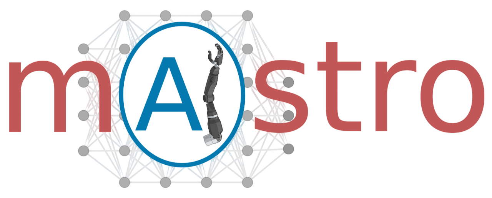

  

> An open-source multi-agentic system for automated end-to-end development of radiomics and deep learning models for medical imaging

  

---

## 🚀 About mAIstro
**mAIstro** is an autonomous, open-source multi-agentic system designed to orchestrate the full pipeline of medical imaging AI development — from **exploratory data analysis (EDA)** and **radiomics feature extraction** to **training and deploying deep learning models**.  
Built around a team of specialized agents, mAIstro enables researchers and clinicians to interact with complex AI workflows **using natural language prompts** — no coding required.

🌐 **LLM-Agnostic Design**: mAIstro can operate with both open-source and commercial LLMs (e.g., GPT-4, Claude, DeepSeek, LLaMA, Qwen), providing flexibility across environments.

Built on top of 🤗 Hugging Face's [smolagents](https://github.com/huggingface/smolagents) framework.

---

## ✨  Key Features
- 🔎 Autonomous **Exploratory Data Analysis (EDA)**
- 🧬 **Radiomics feature extraction** (for CT, MRI, and multi-parametric imaging)
- ⚙️ **nnU-Net Agent** for segmentation model development and implementation
- ⚙️ **TotalSegmentator Agent** for full-body and organ-specific automatic segmentation
- 🖼️ **Image Classification Agent** (ResNet, VGG16, InceptionV3 architectures)
- 📊 **Feature Importance and Feature Selection**
- 📈 **Tabular data Classification and Regression Agents**
- 🛠️ Modular tool-based architecture for extensibility
- 🧾 Integrated in a single user-friendly Jupyter Notebook

---

## 🔧 Dependencies

The framework relies on the following core Python packages:

- `torch` (PyTorch)
- `nnunetv2`
- `totalsegmentator`
- `smolagents`
- `pycaret`
- `pyradiomics`

Users should ensure these libraries are installed and properly configured before using the system. 

For nnU-Net setup and environment configuration, please follow the official instructions:  
🔗 [nnU-Net Setup Guide](https://github.com/MIC-DKFZ/nnUNet/blob/master/documentation/installation_instructions.md)

---

## 🧠 How to Use

- Open and run the `mAIstro.ipynb` notebook.
- Choose a natural language prompt corresponding to your task (e.g., train a model, extract radiomics, perform EDA).
- mAIstro's agents will autonomously reason, select the right tools, execute the task, and generate outputs.
- All results (plots, trained models, reports) will be saved automatically in specified directories.

---

## 📚 Documentation
A full user guide and advanced examples will be provided soon.  
Stay tuned for updates!

---

## 🤝 Contributing

Contributions are welcome!  
Please feel free to fork the repository and submit pull requests. For major changes, open an issue first to discuss your ideas.

---

## 📄 License

This project is licensed under the **Apache License 2.0**.  
You are free to use, modify, and distribute this software under the terms of the license.

---

## 🧡 Acknowledgments

- 🤗 Huggingface [`smolagents`](https://github.com/huggingface/smolagents) for lightweight agentic abstractions
- ⚙️ [`nnU-Net`](https://github.com/MIC-DKFZ/nnUNet) for segmentation pipelines
- ⚙️ [`TotalSegmentator`](https://github.com/wasserth/TotalSegmentator) for multi-organ segmentation
- 🧬 [`PyRadiomics`](https://github.com/Radiomics/pyradiomics) for radiomics feature extraction
- 📊 [`PyCaret`](https://github.com/pycaret/pycaret) for tabular data modeling

---

### 📚 Cite this work

If you use **mAIstro** in your research, please cite:

>Tzanis E., & Klontzas M. E. (2025). *mAIstro: an open-source multi-agentic system for automated end-to-end development of radiomics and deep learning models for medical imaging*. arXiv: [2505.03785](https://arxiv.org/abs/2505.03785), DOI: [https://doi.org/10.48550/arXiv.2505.03785](https://doi.org/10.48550/arXiv.2505.03785)

---

